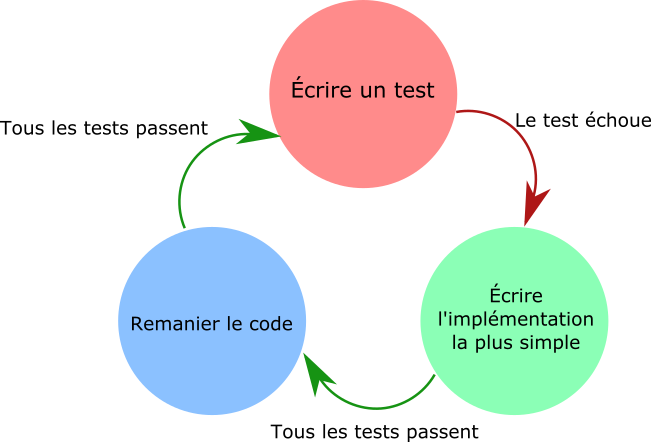

# FizzbuzzKataTDDPairProg
Le kata FizzBuzz en pair programming et Test Driven Developpment

## Context

Ecrivez un programme qui imprime les nombres de 1 à 100. Mais pour les multiples de trois, imprimez "Fizz" à la place du nombre et pour les multiples de cinq, imprimez "Buzz". Pour les nombres qui sont à la fois multiples de trois et de cinq, il faudra imprimer "FizzBuzz".

Exemple de sortie :

<br>1
<br>2
<br>Fizz
<br>4
<br>Buzz
<br>Fizz
<br>7
<br>8
<br>Fizz
<br>Buzz
<br>11
<br>Fizz
<br>13
<br>14
<br>FizzBuzz
<br>16
<br>17
<br>Fizz
<br>19
<br>Buzz
<br>... etc jusqu'à 100

Utilisez les techniques de pair programming et de Test Driven Developpment pour réaliser ce programme.

## Modalité pédagogique

### Pairprogramming 

* 1 personne au clavier (le conducteur) qui a interdiction de parler
* 1 personne qui dit quoi faire (le navigateur) de manière globale (pas de détail)

On tourne toutes les 10 minutes (4 rotations) [timer en ligne où rentrer vos noms et intervertir quand c'est terminé](http://mobtimer.zoeetrope.com/)

### TDD



### Visual Studio

Obligation d'utiliser Visual Studio avec l'explorateur de test (Test > Explorateur de test ) et le raccourci Ctrl + R, T pour lancer tous les tests.


### Tips and Trick

```csharp
Print ($"15 est-t-il un multiple de 5 ? {15 % 5 == 0 ? 'Oui' : 'Non'} !);
```

## Modalité d'évaluation

CRAFT !!
* nom de méthode / variable explicites
* convention de nommage respectée
* deux tabulations par méthode maximales
* on ne se répète pas
* 50 lignes maximum par méthode
* 80 caractères maximum par ligne
* commentaire de méthode
* pas de nombre/texte magique (CONSTANTE à la place)

## Ressources

- [Paramètres pour les TU en Nunit](https://learn.microsoft.com/fr-fr/dotnet/core/testing/unit-testing-with-nunit#adding-more-features)